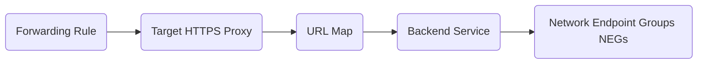

# csf: Infrastructure as a Code

[](https://vscode.dev/redirect?url=vscode://ms-vscode-remote.remote-containers/cloneInVolume?url=git@gitlab.com:psi-software-se/terraform/teams/sbox/csf.git)

## Architecture

This repository defines the CSF Sandbox project within the Google Cloud in the form of Infrastructure as Code (IaC) using the Terraform tool.
By using Workload Identity Federation configuration inside [gcp-3-project-factory-sbox](https://gitlab.com/psi-software-se/terraform/gcp-3-project-factory-sbox) Google Cloud APIs trust calls made from CI/CD pipelines in this repository.

The sandbox environments are subject to quite a few restrictions, especially regarding internet connections and the inability to set up VPN connections. By default, all ingress and egress traffic is blocked. Load balancers secured by the so-called Identity Aware Proxy may be an exception.

For now the project setup consists of:

* VPC network with subnets only in europe-west3 (Frankfurt)
* Private Google Access and firewall rules to allow egress traffic to Google APIs from VPC and ingress traffic from IAP, LB
* Artifact registry to store docker images and other artifacts produced by CSF CI/CD pipelines
* GKE - Google Kubernetes Engine to run our test/demo applications
* VMs - mostly for testing internal connectivity or on-prem like clusters
* External Load Balancer with the Identity-Aware Proxy with Nginx Ingress Controller backend running in GKE cluster
* Secure Web Proxy (together with internal CloudNAT) - limited access to the Internet from VMs and clusters


### ELB setup with Nginx Ingress Controller

The External Load Balancer (ELB) consists of many smaller elements:



* Network endpoint groups: created by Nginx Ingress Controller in GKE cluster. There will be as many of them as zones in GKE cluster
* Backend service: a Load Balancer object for traffic distribution between NEGs. 
* URL Map: a routing configuration for incoming requests to backend services. In our case we have only one default service routing all incoming requests to a single backend service.
* Target HTTPS Proxy: the proxy terminates incoming requests and creates a new connection from the Load Balancer to the backend service. It is configured with SSL Certificate.
* Forwarding rule: represents a frontend configuration with an IP address, port, protocol, etc. The acquired IP address needs to be added to DNS to ensure the domain works correctly. In our case we added A record for domain *.csf.psi-cloud.com pointing to the ELB IP address.

For ELB to be installed correctly, Network Endpoint Groups must also exist in the account. These can only be created after the cluster has been created by installing Nginx Ingress Controller with the appropriate parameters.

Check the folder [nginx](nginx/README.md).

When starting from scratch you need to set lb_neg_zones=[] in terraform.tfvars at the beginning until the cluster is ready, Nginx Ingress is installed and there already
nodes created in the cluster for each specified zone.

## How to prepare development environment

* it is recommended to use a Dev Container which definition is provided in this repository (see [.devcontainer/devcontainer.json](.devcontainer/devcontainer.json))
* alternatively all necessary tools can be installed locally
* for more details visit [this page on Confluence](https://intranet-psise.atlassian.net/wiki/x/f3ERAw)

## How to authenticate to GCP

```shell
# authentication to both work in shell and with terraform
gcloud auth login --no-launch-browser --update-adc
# set current project for next commands
gcloud config set project psi-de-0-sbox-csf
```

## How to work with Terraform

* initiate environment

    ```shell
    terraform init
    ```

* see the plan

    ```shell
    terraform plan -lock=false
    ```

* use the modules from the [common repository](https://gitlab.com/psi-software-se/terraform/modules)

    ```hcl
    # example
    module "bucket" {
        source = "git@gitlab.com:psi-software-se/terraform/modules.git//gcs?ref=stable"
        # ...
    }
    ```

* see [example recipes on Confluence](https://intranet-psise.atlassian.net/wiki/x/zXERAw)
* see the [official documentation](https://registry.terraform.io/providers/hashicorp/google/latest/docs) of the terraform Google provider

## How to locally access images in Artifact Registry

```shell
gcloud auth configure-docker [[LOCATION]]-docker.pkg.dev
docker pull [[LOCATION]]-docker.pkg.dev/[[PRJ_NAME]]/[[REGISTRY]]/[[IMAGE_NAME]]:[[TAG]]
# example:
gcloud auth configure-docker europe-west3-docker.pkg.dev
docker pull europe-west3-docker.pkg.dev/psi-de-0-sbox-csf/artifacts/nginx:latest
```

## How to locally access GKE cluster

* add GKE cluster to local `.kube/config`

    ```shell
    gcloud container clusters get-credentials [[CLUSTER_NAME]] --region europe-west3 --project [[PROJECT_ID]]
    # example:
    gcloud container clusters get-credentials gke-1 --region europe-west3 --project psi-de-0-sbox-csf
    ```

* verify by making example `kubectl` calls

    ```shell
    kubectl cluster-info
    # start nginx:
    kubectl create deployment nginx --image=europe-west3-docker.pkg.dev/psi-de-0-sbox-csf/artifacts/nginx --port=80
    # forward port:
    kubectl port-forward deploy/nginx 8080:80
    curl http://localhost:8080
    kubectl delete deploy nginx
    ```
