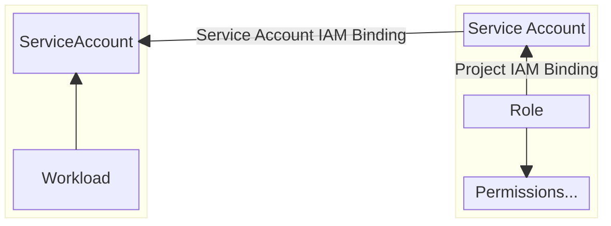

# Kubernetes Pod Permissions

## Workload Permissions

### Problem Description

The Google Cloud Platform defines a wide range of permissions and is responsible for applying them.
A workload (usually a `Pod`) is defined by an application team, and requires certain permissions.
Permissions cannot be granted to workloads directly.

### Solution

Each of the components in **bold face** below has to be created.
* An **IAM Service Account** that represents the workload. To associate permissions with it, we also need:
  * A set of **IAM Roles** that cover the required permissions. If Google's [predefined roles](https://console.cloud.google.com/iam-admin/roles) are not enough, a team might have to define a role on their own.
  * A **Project IAM Binding** that associates a set of IAM Roles with the IAM Service Account.
* A **Kubernetes ServiceAccount** that also represents the workload.
  * The **Pod** [impersonates](https://kubernetes.io/docs/tasks/configure-pod-container/configure-service-account/#use-the-default-service-account-to-access-the-api-server) the Kubernetes ServiceAccount by referencing it via `spec.ServiceAccountName`.
* A **Service Account IAM Binding** specifying that the Kubernetes ServiceAccount is allowed to impersonate the IAM Service Account.
  * To actually impersonate it, the Kubernetes ServiceAccount has to reference the IAM Service Account via the `iam.gke.io/gcp-service-account`.

We need two service account resources (Kubernetes and IAM) for the same workload because we cannot directly associate roles with Kubernetes ServiceAccounts, and we cannot reference IAM Service Accounts directly from Kubernetes Pods.

